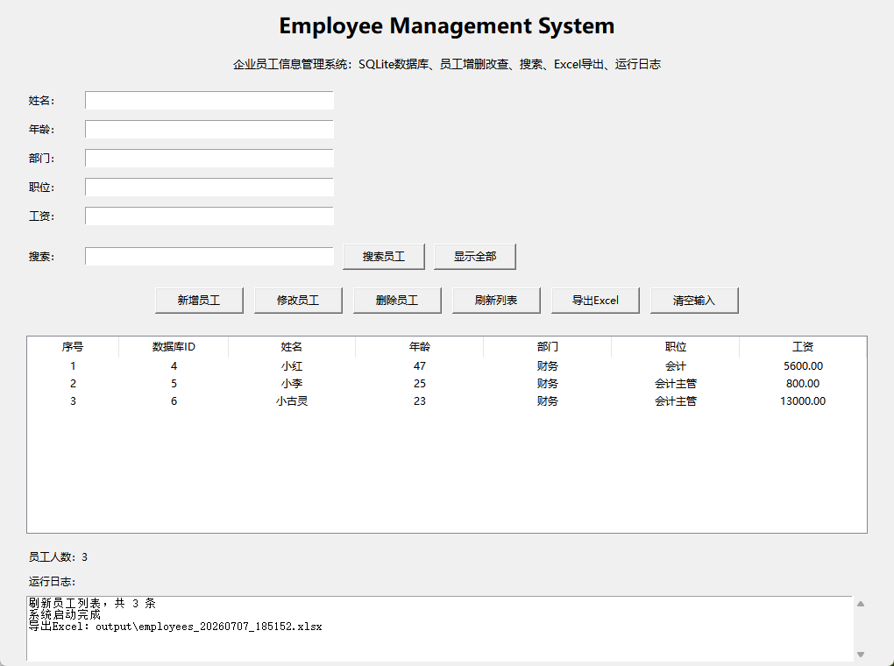
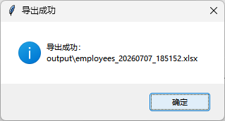

# 👨‍💼 Employee Management System

> 基于 Python + SQLite 开发的企业员工信息管理系统。

一个模拟企业内部员工管理场景的桌面应用，支持员工新增、修改、删除、搜索、列表展示、Excel 导出、运行日志记录等功能，适用于企业信息管理、数据库练习及 Python 自动化项目展示。

---

# ✨ Project Features

✅ SQLite 数据库存储

✅ 员工新增

✅ 员工修改

✅ 员工删除

✅ 员工搜索

✅ 员工列表展示

✅ Excel 数据导出

✅ 自动时间戳文件名

✅ GUI 图形界面

✅ 运行日志记录

✅ 模块化项目结构

---

# 📷 Software Preview

## 图形界面



---

## 导出的 Excel


---

## 导出成功



---

# 📁 Workflow

```text
GUI Input
    │
    ▼
Employee CRUD
    │
    ▼
SQLite Database
    │
    ▼
Search / Update / Delete
    │
    ▼
Export Excel
    │
    ▼
Generate Log
```

---

# 📂 Project Structure

```text
employee-management-system/

├── config/
│
├── database/
│   └── employee.db
│
├── docs/
│   ├── gui.png
│   ├── excel.png
│   └── result.png
│
├── logs/
│
├── output/
│
├── src/
│   ├── database.py
│   ├── employee.py
│   ├── exporter.py
│   ├── logger.py
│   └── __init__.py
│
├── gui.py
├── main.py
├── requirements.txt
├── README.md
└── .gitignore
```

---

# 🔧 Technology Stack

| 技术 | 说明 |
|------|------|
| Python | 开发语言 |
| SQLite | 本地数据库 |
| SQL | 数据增删改查 |
| Tkinter | GUI 图形界面 |
| Pandas | 数据处理 |
| OpenPyXL | Excel 导出 |
| Logging | 日志记录 |

---

# 🚀 Quick Start

## 1. 安装依赖

```bash
pip install -r requirements.txt
```

---

## 2. 初始化数据库

```bash
python src/database.py
```

---

## 3. 启动 GUI

```bash
python gui.py
```

---

# 💼 Business Scenario

本项目模拟企业内部员工信息管理系统。

适用于：

- 员工信息管理
- HR 数据维护
- 企业后台管理
- SQLite 数据库练习
- Python GUI 项目
- Excel 数据导出
- CRUD 增删改查场景

典型流程：

```text
录入员工信息
      │
      ▼
保存到 SQLite
      │
      ▼
查询 / 修改 / 删除
      │
      ▼
导出 Excel
      │
      ▼
生成运行日志
```

---

# ⭐ Project Highlights

- 模块化项目架构
- SQLite 数据库存储
- SQL 增删改查
- GUI 桌面工具
- TreeView 表格展示
- 员工搜索功能
- Excel 自动导出
- 自动生成时间戳文件名
- 运行日志记录
- 企业级目录结构

---

# 📈 Project Result

✔ 成功创建 SQLite 数据库

✔ 实现员工新增、修改、删除、查询

✔ 实现关键词搜索员工

✔ 实现 Excel 自动导出

✔ 实现 GUI 图形化操作

✔ 实现运行日志记录

✔ 实现模块化代码设计

---

# 👨‍💻 Author

Joy Wang

GitHub：

https://github.com/wjoy00337-debug
